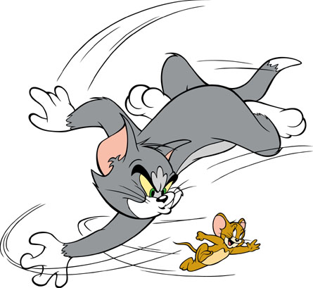
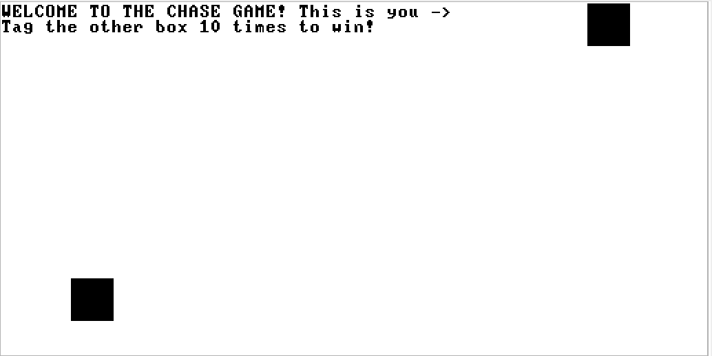

# The Chase Game!

Hello and welcome to the Chase Game! Inspired by my love for the Hanna Barbara classic cartoon, Tom and Jerry, I created a very basic chase game that simulates their wacky antics!

First, to load the game, compile the code using a JackCompiler and then run the newly made VM files in a VMEmulator.

Now, from there you should see the welcome screen and 2 boxes (shown below).

You control the box near the top right with the arrow keys and the box at the bottom will move autonomously.
(Note: If you have a buddy, they can play as that box using the "WASD" controls. However, the box may not move exactly as you choose ;)).

Press the space bar when your box is directly on top of the other box to "tag" that box. Tag the box 10 times, and you win the game!

Happy Chasing!